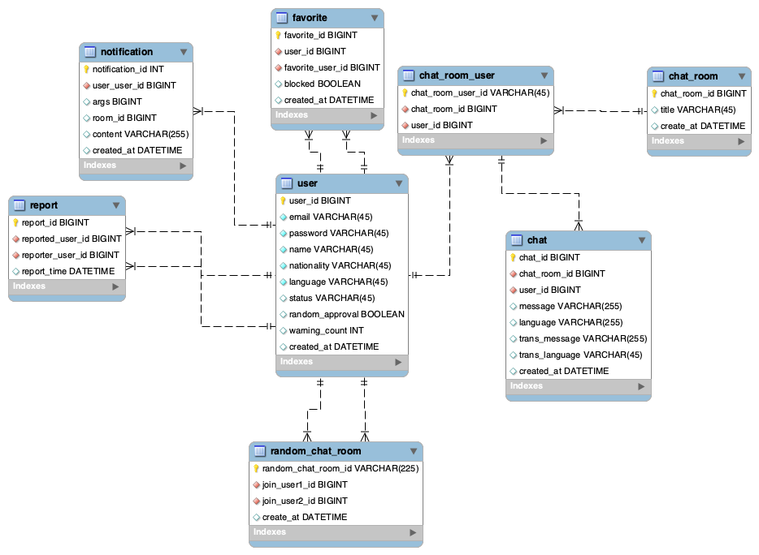

# 🌏💬 실시간 채팅 번역 서비스

다국어 사용자들이 실시간으로 대화를 번역하여 소통할 수 있는 서비스를 제공하고자 합니다.

---
## ⚙️ Tech Stack

- Java 11
- Spring Boot MVC
- Gradle
- JWT
- Mysql
- Redis
- ElasticSearch
- WebSocket
- Stomp
- 번역 api : papago api
---

## 📋 프로젝트 기능 및 설계
### 🙋 회원
- [회원가입 기능]
    - 사용자는 회원가입을 할 수 있다. 일반적으로 모든 사용자는 회원가입시 USER 권한 (일반 권한)을 지닙니다.
      회원가입시 아이디와 패스워드, 서비스에서 사용할 이름, 국적, 언어를 입력받으며, 아이디와 서비스에서 사용할 이름은 unique 해야합니다.
- [로그인 기능]
    - 사용자는 로그인을 할 수 있다. 로그인시 회원가입때 사용한 아이디와 패스워드가 일치해야 합니다.
    - 로그인 성공 시 사용자에게 JsonWebToken 을 발급합니다.
- [회원 정보 조회]
    - 사용자는 회원 정보(국적, 사용 언어, 이름)을 조회할 수 있습니다.
    - 친구 요청을 할 수 있습니다.
    - 신고하기(랜덤 채팅에서만 가능하며, 친구는 신고할 수 없습니다.)
- [내 정보 수정]
    - 사용자는 자신의 회원 정보(국적, 사용 언어, 이름)를 수정할 수 있습니다.
- [탈퇴하기]
    - 사용자는 계정을 삭제하여 탈퇴할 수 있습니다.
---
### 👯 친구
- [친구 요청]
  - 사용자는 친구요청을 하거나 요청을 '수락/거절' 을 할 수 있습니다. 
- [친구 찾기 기능]
    - 사용자는 '이름'으로 검색해 상대방의 회원 정보를 조회 할 수 있습니다.
- [친구 차단 기능]
    - 사용자는 친구로 등록된 회원을 차단할 수 있습니다.
    - 차단된 친구는 자신이 차단된 상태인지 모릅니다.
    - 차단된 친구는 사용자에게 메세지를 보낼 경우 "사용자를 찾을 수 없습니다."라고 안내문구가 나옵니다.
- [친구 목록 조회 기능]
    - 친구로 등록된 회원 목록을 조회할 수 있습니다.
- [차단된 친구 목록 조회/ 차단 해제 기능]
    - 차단된 친구 목록을 조회할 수 있고, '차단 해제'를 할 수 있습니다.
- [친구 대화 기능]
    - 실시간으로 메세지가 번역되어 특정 친구와 1:1대화를 할 수 있습니다.
    - 사용자가 대화방을 생성하여 친구를 대화방으로 초대합니다.(대화 요청)
      - 친구는 대화 초대를 '수락/거절' 할 수 있습니다.  
    - 나의 메세지를 서버에서 상대방의 언어로 번역하여 메세지를 전송합니다.
- [친구 대화방 목록 조회 기능]
    - 대화했던 친구와의 대화방 목록을 조회할 수 있습니다.
---
### 🎲 랜덤
- [랜덤 매칭 대화 기능]
  - 랜덤 채팅방은 1:1로만 매칭 됩니다.
  - 나의 메세지를 서버에서 상대방의 언어로 번역하여 메세지를 전송합니다.
  - 랜덤으로 매칭되며, 5분이 지나도록 매칭되지 않을 경우 "채팅 상대를 찾지 못 하였습니다."안내문구가 나옵니다.
  - 선행 규칙
    - 두 유저 가운데, 룸을 생성하는 사람을 룸 생성자라고 규정합니다.
    - 두 유저 가운데, 존재하는 룸에 참여하는 사람을 룸 입장자라고 규정합니다.
    - 매칭된 채팅방에서 한명이라도 나가면 "ooo님이 나갔습니다." 안내 후 대화방, 대화 내역이 삭제됩니다.
        - 회원 A
            1. 랜덤 채팅방 탐색
            2. 참여할 방이 없으면 방 생성
            3. 5분 유효시간 동안 참여자가(joiner) 없으면 "채팅 상대를 찾지 못 하였습니다." 안내 후 방 삭제
            4. 다시 채팅방 탐색하여 방 생성 또는 참여
        - 회원 B
            1. 랜덤 채팅방 탐색
            2. 참여할 방이 있으면 방 참여

    - [랜덤 채팅 신고 기능]
        - 사용자는 상대방을 신고할 수 있습니다.
          - 신고 대상이 이미 '이용 정지 상태'이거나 한달 안에 신고한 적이 있다면 신고 불가합니다.
        - 신고 받은 회원은 경고를 받습니다.
        - 경고 누적 3회를 받은 회원은 '랜덤 채팅 기능'을 일주일 이용 정지됩니다.
          - 아용 정지 해제 후 경고 횟수는 0으로 초기화 됩니다.
---

## 🔍 ERD

---
## 🐥 papago api
- 1일 10000자 무료.
  - Redis를 활용해 최적화할 수 있음. 
- 만약 원본언어 -> 목적언어로 안되는 경우
    - 원본언어를 한국어로 번역 후 목적언어로 번역

| 원본 언어(언어 코드)	   | 	목적 언어(언어 코드)	  |	원본 언어(언어 코드)		|목적 언어(언어 코드)|
|-----------------|-----------------|---|---|
| 한국어(ko)	→       | 	영어(en)	        |	영어(en)	→|	한국어(ko)|
| 한국어(ko)	→       | 	일본어(ja)	       | 	일본어(ja)	→|	한국어(ko)|             
| 한국어(ko)	→       | 	중국어 간체(zh-CN)	 | 	중국어 간체(zh-CN)	→|	한국어(ko)  |     
| 한국어(ko)	→       | 	중국어 번체(zh-TW)	 | 	중국어 번체(zh-TW)	→|	한국어(ko)  |     
| 한국어(ko)	→       | 	베트남어(vi)	      | 	베트남어(vi)	→|	한국어(ko)    |        
| 한국어(ko)	→       | 	인도네시아어(id)	    | 	인도네시아어(id)	→|	한국어(ko)   |       
| 한국어(ko)	→       | 	태국어(th)	       | 	태국어(th)	→|	한국어(ko)     |        
| 한국어(ko)	→       | 	독일어(de)	       | 	독일어(de)	→|	한국어(ko)     |        
| 한국어(ko)	→       | 	러시아어(ru)	      | 	러시아어(ru)	→|	한국어(ko)     |       
| 한국어(ko)	→       | 	스페인어(es)	      | 	스페인어(es)	→|	한국어(ko)     |       
| 한국어(ko)	→       | 	이탈리아어(it)	     | 	이탈리아어(it)	→|	한국어(ko)        |   
| 한국어(ko)	→       | 	프랑스어(fr)	      | 	프랑스어(fr)	→|	한국어(ko)      |      
| 영어(en)	→        | 	일본어(ja)	       | 	일본어(ja)	→|	영어(en)       |       
| 영어(en)	→        | 	프랑스어(fr)	      | 	프랑스어(fr)	→|	영어(en)       |      
| 영어(en)	→        | 	중국어 간체(zh-CN)	 | 	중국어 간체(zh-CN)	→|	영어(en)      |  
| 영어(en)	→        | 	중국어 번체(zh-TW)	 | 	중국어 번체(zh-TW)	→|	영어(en)     |   
| 일본어(ja)	→       | 	중국어 간체(zh-CN)	 | 	중국어 간체(zh-CN)	→|	일본어(ja)      | 
| 일본어(ja)	→       | 	중국어 번체(zh-TW)	 | 	중국어 번체(zh-TW)	→|	일본어(ja)       |
| 중국어 간체(zh-CN)	→ | 	중국어 번체(zh-TW)	 | 	중국어 번체(zh-TW)	→|	중국어 간체(zh-CN) |

---

## 💥 Trouble Shooting
[go to the trouble shooting section](docs/TROUBLE_SHOOTING.md)